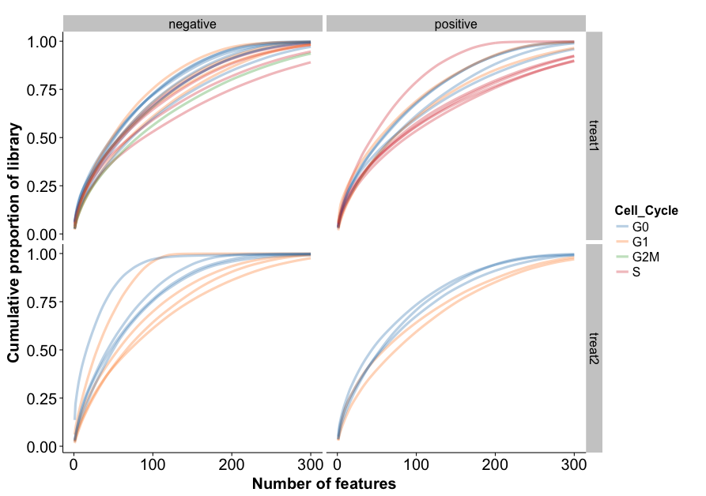
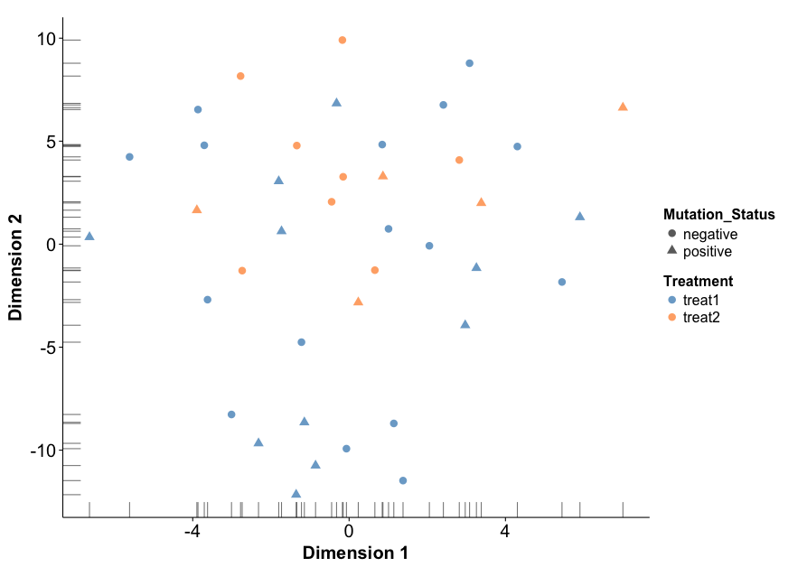
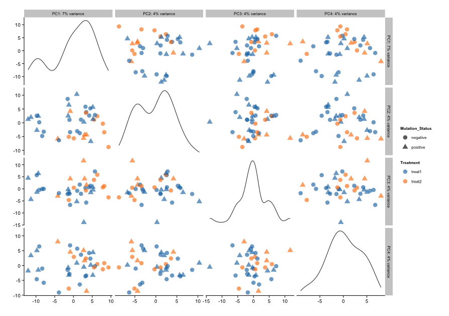
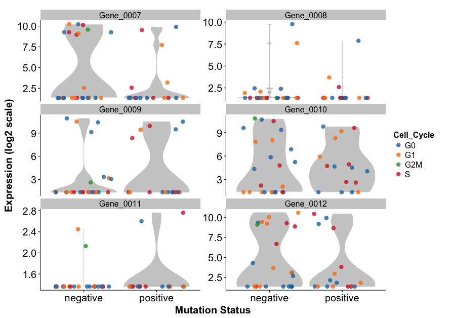
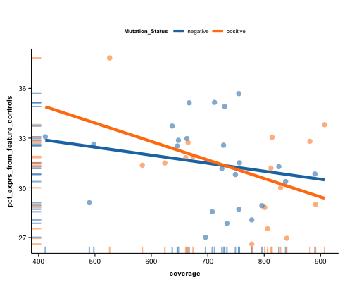
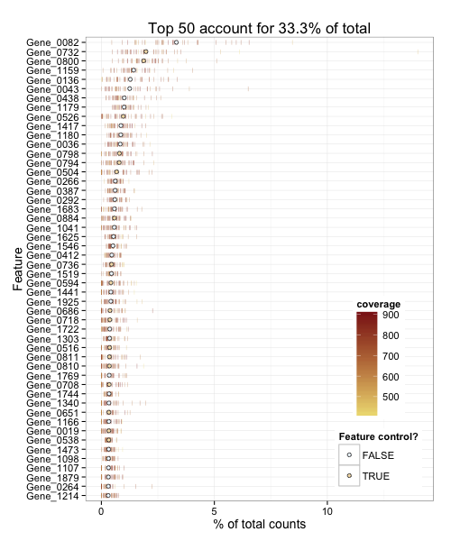
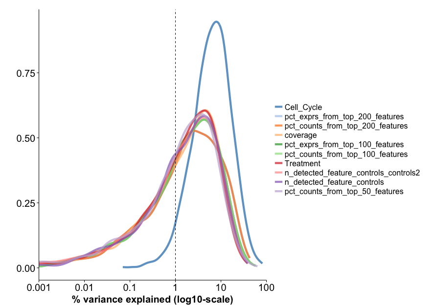

# scater: single-cell analysis toolkit for expression with R

This package contains useful tools for the analysis of single-cell
gene expression data using the statistical software R. The package places an
emphasis on tools for quality control, visualisation and pre-processing of data
before further downstream analysis.

We hope that `scater` fills a useful niche between raw RNA-sequencing
count data and more focused downstream modelling tools such as
[monocle](http://www.bioconductor.org/packages/release/bioc/html/monocle.html),
[scLVM](http://github.com/PMBio/scLVM),
[SCDE](http://pklab.med.harvard.edu/scde/index.html),
[edgeR](http://www.bioconductor.org/packages/release/bioc/html/edgeR.html),
[limma](http://www.bioconductor.org/packages/release/bioc/html/limma.html) and
so on.

Briefly, `scater` enables the following:


1. Automated computation of QC metrics
1. Transcript quantification from read data with pseudo-alignment
2. Data format standardisation
3. Rich visualisations for exploratory analysis
4. Seamless integration into the Bioconductor universe
5. Simple normalisation methods

See below for information about installation, getting started and highlights of the package.

## Installation
This package currently lives on GitHub, so I recommend using Hadley Wickham's
`devtools` package to install `scater` directly from GitHub. If you don't have
`devtools` installed, then install that from CRAN (as shown below) and then run
the call to install `scater`:

```{r}
install.packages("devtools")
devtools::install_github("davismcc/scater", build_vignettes = TRUE)
```

Using the most recent version of R is strongly recommended (R 3.2.2 at the time
of writing). Effort has been made to ensure the package works with R >3.0, but
the package has not been tested with R <3.1.1.

There are several other packages from CRAN and Bioconductor that `scater` uses,
so you will need to have these packages installed as well. The CRAN packages
should install automatically when `scater` is installed, but you will need to
install the Bioconductor packages manually.

Not all of the following are strictly necessary, but they enhance the
functionality of `scater` and are good packages in their own right. The commands
below should help with package installations.

CRAN packages:

```{r}
install.packages(c("cowplot", "data.table", "ggplot2", "ggthemes", "knitr",
    "matrixStats", "MASS", "plyr", "reshape2", "rjson", "Rtsne", "testthat"))
```

Bioconductor packages:

```{r}
source("http://bioconductor.org/biocLite.R")
biocLite(c("Biobase", "BiocGenerics", "biomaRt", "edgeR", "limma", "monocle", "rhdf5"))
```

You might like to install `dplyr` from Hadley Wickham's GitHub site (`dplyr` was
not available on CRAN for R 3.2.0 when this was written):

```{r}
devtools::install_github("hadley/lazyeval")
devtools::install_github("hadley/dplyr")
```

We plan to contribute `scater` to Bioconductor in the near future.


## Getting started

<!---
The best place to start is the [vignette](http://htmlpreview.github.io/?http://github.com/davismcc/scater/blob/master/vignettes/vignette.html).
-->

The best place to start is the vignette. From inside an R session, load `scater`
and then browse the vignettes:

```{r}
library(scater)
browseVignettes("scater")
```

There is a detailed HTML document available that introduces the main features
and functionality of `scater`.

## `scater` workflow

The diagram below provised an overview of the pre-processing and QC workflow possible in `scater`, listing the functions that can be used at various stages.


## Highlights

The `scater` package allows you to do some neat things relatively quickly. Some highlights are shown below with example code and screenshots.

1. Automated computation of QC metrics
1. Transcript quantification from read data with pseudo-alignment
2. Data format standardisation
3. Rich visualisations for exploratory analysis
4. Seamless integration into the Bioconductor universe
5. Simple normalisation methods

For details of how to use these functions, please consult the **vignette** and **package documentation**.  The plots shown use the example data included with the package (for which there is no interesting structure) and as shown require only one or two lines of code to generate.

### Automatic computation of QC metrics

Use the `calculateQCMetrics` function to compute many metrics useful for gene/transcript-level and cell-level QC. Metrics computed include number of genes expressed per cell, percentage of expression from control genes (e.g. ERCC spike-ins) and many more.

### Transcript quantification with `kallisto`

The `runKallisto` function provides a wrapper to the [`kallisto`](http://pachterlab.github.io/kallisto) software for quantifying transcript abundance from FASTQ files using a pseudo-alignment approach. This new approach is extremely fast. With `readKallisto`, transcript quantities can be read into a data object in `R`.

### Default `plot` for an SCESet object



### `plotTSNE`



### `plotPCA`



### `plotExpression`

Plot the expression values for a selection of features.



### QC plots

### `plotPhenoData`

Plot two phenotype metadata variables (such as QC metrics).



See also `plotFeatureData` to plot feature (gene) metadata variables, including QC metrics.

#### Plot most highly-expressed genes (or features)



#### Density plot to assess the relative importance of explanatory variables



Plus many, many more possibilities. Please consult the vignette and documentation for details.

## Acknowledgements and disclaimer

The package leans heavily on previously published work and packages, namely
[edgeR](http://bioconductor.org/packages/release/bioc/html/edgeR.html) and
[limma](http://bioconductor.org/packages/release/bioc/html/limma.html). The
`SCESet` class is inspired by the `CellDataSet` class from [monocle](http://www.bioconductor.org/packages/release/bioc/html/monocle.html).


<!---
It also uses and extends code for an approximate rank-product test by [Heskes et al (2014)](http://dx.doi.org/10.1186/s12859-014-0367-1).
-->


The package is currently in an Alpha state, and under heavy development so may
change without warning. Please do try it, though, and contact me with bug
reports, feedback, feature requests, questions and suggestions to improve the
package.

Davis McCarthy, September 2015
